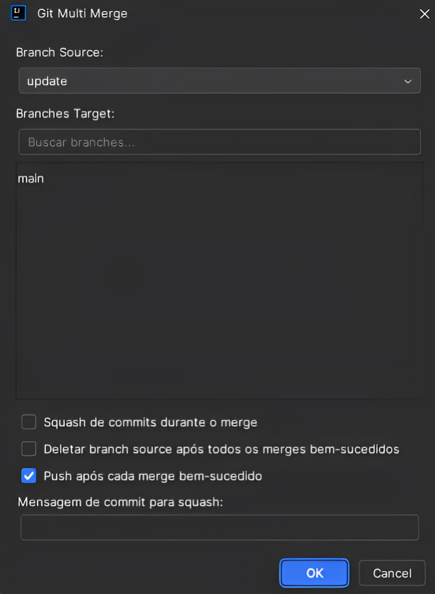
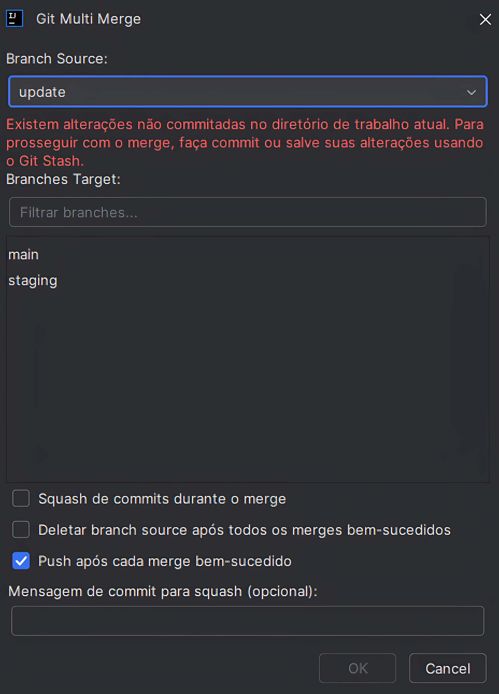
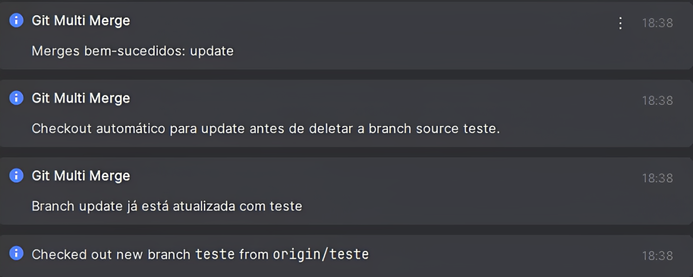
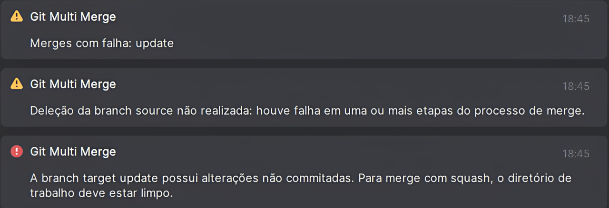

# Git Multi Merge Plugin

[](LICENSE)

Plugin para IntelliJ IDEA que permite realizar o merge de uma branch source para múltiplas branches target simultaneamente, com opções de push automático e limpeza de branches. Estruturado de forma modular, seguindo boas práticas de arquitetura e responsabilidade única.

## Índice
- [Estrutura de Pacotes](#estrutura-de-pacotes)
- [Arquitetura](#arquitetura)
- [Screenshots](#screenshots)
- [Funcionalidades](#funcionalidades)
- [Requisitos](#requisitos)
- [Instalação Manual](#instalação-manual)
- [Como Usar](#como-usar)
- [Interface Redesenhada](#interface-redesenhada)
- [Fluxo de trabalho completo do plugin](#fluxo-de-trabalho-completo-do-plugin)
- [Suporte a Múltiplos Idiomas](#suporte-a-múltiplos-idiomas)
- [Solução de problemas](#solução-de-problemas)
- [Limitações](#limitações)
- [Contribuição](#contribuição)
- [Versões](#versões)
- [Licença](#licença)
- [Contato](#contato)
- [Exemplo de uso](#exemplo-de-uso)

## Estrutura de Pacotes

O projeto segue uma organização baseada em padrões de projeto, facilitando a manutenção e expansão:

```
src/
  main/
    java/
      com/
        plugin/
          gitmultimerge/
            command/   # Ações encapsuladas (Command Pattern)
              GitMultiMergeAction.java
            service/   # Serviços de negócio, integrações e contratos
              interface/   # Contratos (interfaces) do domínio de serviço
                GitMultiMergeService.java
                GitRepositoryOperations.java
                MergeStep.java
              GitMultiMergeServiceImpl.java
              GitRepositoryOperationsImpl.java
              PullBranchStep.java  # Novo step: realiza git pull na branch target antes do merge
              (demais etapas e contextos do fluxo de merge)
            ui/        # Componentes de interface gráfica
              GitMultiMergeDialog.java
            util/      # Utilitários e helpers
              MessageBundle.java
              NotificationHelper.java
```

- **command/**: Contém ações do plugin, como a ação principal de merge.
- **service/interface/**: Contratos (interfaces) para serviços e operações Git.
- **service/**: Implementações concretas, etapas do fluxo e contexto do merge.
- **ui/**: Diálogos, painéis e componentes de interface.
- **util/**: Classes utilitárias, helpers e internacionalização.

> **Observação:** Novos pacotes para padrões de design (ex: builder, factory, observer, strategy) devem ser criados apenas quando houver necessidade real de expansão, mantendo a estrutura enxuta e organizada.

## Arquitetura

O projeto segue uma arquitetura modular, separando claramente responsabilidades:

- **UI (`ui/`)**: Responsável apenas pela exibição e interação com o usuário.
- **Serviços (`service/` e `service/interface/`)**: Contêm a lógica de negócio, contratos e integrações com o Git.
- **Comandos (`command/`)**: Ações disparadas pela interface do usuário.
- **Utilitários (`util/`)**: Helpers para internacionalização e notificações.

Essa separação facilita a manutenção, testes e futuras expansões.

## Screenshots

<div>
  <table>
    <tr>
        <td>
            <br>
            <sub>Seleção de Branches</sub>
        </td>
        <td>
            <br>
            <sub>Branches com Alterações</sub>
        </td>
        <td>
            <br>
            <sub>Notificação de Sucesso</sub>
            <br>
            <sub>Notificação de Erro</sub>
        </td>
    </tr>
  </table>
</div>

## Funcionalidades

- Selecionar uma branch source e até 5 branches target para merge
- **Layout vertical otimizado** com foco na visualização de branches target
- Interface otimizada com ComboBox para branch source e campo de busca para branches target
- Seleção automática da branch atual como source padrão
- Push automático para remotes após merge bem-sucedido
- Opção para squash commits durante o merge com commit automático
- Opção para deletar branch source (local e remota) após o merge bem-sucedido
- Atualização automática das informações do repositório com fetch e prune
- Visualização de progresso em tempo real com feedback detalhado
- Detecção e notificação de conflitos
- Identificação de problemas com hooks Git
- Notificação detalhada dos resultados das operações
- **Suporte completo a múltiplos idiomas** (Inglês, Português do Brasil e Espanhol)
- **Detecção automática do idioma do sistema**
- **Validação assíncrona** de alterações não commitadas
- **Processamento em background** para melhor performance
- **Atualizações de UI thread-safe**

---

### Novidades e Melhorias Recentes

- **Sincronização Automática com a Interface do IntelliJ:**  
  Após operações como checkout, push, fetch e deleção de branch, o plugin força a atualização do repositório na interface do IntelliJ, garantindo que todas as mudanças sejam refletidas imediatamente para o usuário.

- **Deleção Segura da Branch Source:**  
  O plugin detecta automaticamente se a branch source a ser deletada está ativa e realiza o checkout para uma branch segura antes de tentar a deleção, evitando erros de worktree.

- **Push Inteligente para o Remote:**  
  O push para o remote verifica se a branch remota já existe. Se não existir, faz push com upstream (`-u`), criando e rastreando a branch remota automaticamente.

- **Atualização Completa de Referências Remotas:**  
  O comando `fetchAll` executa `git fetch --all --prune` e, em seguida, atualiza o repositório na IDE, garantindo que branches deletadas ou criadas remotamente apareçam corretamente na interface.

- **Internacionalização Robusta:**  
  Todas as mensagens e notificações do plugin são internacionalizadas, com arquivos `.properties` para inglês, português do Brasil e espanhol. Novas chaves são sempre adicionadas de forma consistente.

### Atualizações Importantes

- **Refatoração do Painel de Seleção da Branch Source:**
  O painel foi completamente refeito, agora utilizando um ComboBox com busca dinâmica. O usuário pode digitar para filtrar branches em tempo real, tornando a seleção mais rápida e intuitiva, especialmente em repositórios grandes.

- **Validação do Botão OK (Merge):**
  O botão de merge permanece desabilitado até que todas as validações sejam aprovadas: não pode haver alterações não commitadas na branch source, pelo menos uma branch target válida deve ser selecionada e a branch source não pode ser escolhida como target. Isso previne erros e garante segurança na operação.

- **Ajuste na Ordem dos Steps do Merge:**
  O step de Push para o remote agora ocorre antes do Pull, garantindo que a branch remota exista antes de tentar atualizar. Isso corrige falhas em cenários onde a branch remota ainda não existe, tornando o fluxo mais robusto e confiável.

> Consulte a seção [Fluxo de trabalho completo do plugin](#fluxo-de-trabalho-completo-do-plugin) para detalhes de cada etapa.

## Requisitos

- IntelliJ IDEA 2023.1 ou superior (Community ou Ultimate)
- Git instalado e configurado
- Java 17 ou superior (requisito do IntelliJ IDEA 2023.1+)
- Acesso aos remotes para operações de push e delete (se utilizadas)

## Instalação Manual

1. Clone este repositório
2. Execute o comando `./gradlew buildPlugin` (Linux/Mac) ou `gradlew.bat buildPlugin` (Windows)
3. Instale o plugin manualmente:
   - No IntelliJ IDEA, vá para Settings/Preferences > Plugins
   - Clique no ícone de engrenagem e selecione "Install Plugin from Disk..."
   - Navegue até o diretório `build/distributions` deste projeto
   - Selecione o arquivo ZIP gerado e clique em "OK"
   - Reinicie o IntelliJ IDEA quando solicitado

## Como Usar

1. Abra um projeto com repositório Git no IntelliJ IDEA
2. No menu "Git", selecione a opção "Multi Merge..."
3. Na tela de configuração:
   - A branch atual será pré-selecionada como source no topo da interface
   - Selecione as branches target (até 5) na lista central ampliada
   - Use o campo de busca para filtrar branches (útil em repositórios grandes)
4. Configure as opções desejadas na parte inferior da interface:
   - **Squash commits**: Combina todos os commits da branch source em um único commit
   - **Push para remote após o merge**: Atualiza automaticamente o repositório remoto para cada branch após o merge
   - **Deletar branch source após o merge**: Remove a branch source (local e remota) depois que todos os merges forem bem-sucedidos
5. Adicione uma mensagem de merge personalizada (opcional)
6. Clique em "OK" para iniciar o processo
7. Acompanhe o progresso na barra de status
8. Resolva conflitos, se necessário
9. Verifique o resultado na notificação final

### Dicas
- Utilize o campo de busca para encontrar rapidamente branches em repositórios grandes.
- O botão de merge só será habilitado se não houver alterações não commitadas.
- Mensagens de feedback e erros são exibidas em tempo real na interface.

## Interface Redesenhada

O plugin apresenta um novo design vertical (450x550 pixels) que melhora significativamente a experiência do usuário:

- **Layout Vertical**: Fluxo de trabalho intuitivo de cima para baixo
- **Área Ampliada para Branches**: Visualize mais branches target simultaneamente
- **Controles Compactos**: Opções organizadas de forma mais eficiente
- **Melhor Organização Visual**: Separação clara entre as seções funcionais

## Fluxo de trabalho completo do plugin

1. **Checkout** para cada branch target
2. **Push** da branch target para o remote (se necessário, cria a branch remota e faz o rastreamento)
3. **Pull** da branch target para garantir que está atualizada com o remote
4. **Merge** da branch source para a branch target
5. **Commit** automático após squash (se a opção estiver habilitada)
6. **Push** para o remote (se a opção estiver habilitada)
7. **Fetch com prune** para atualizar as informações do repositório
8. **Checkout** para uma branch segura
9. **Deleção** da branch source local (se solicitado e todos os merges forem bem-sucedidos)
10. **Deleção** da branch source remota (se existir, for solicitado e todos os merges forem bem-sucedidos)
11. **Notificação** do resultado com detalhes de cada operação

## Suporte a Múltiplos Idiomas

O plugin Git Multi Merge suporta os seguintes idiomas:

- Inglês (padrão)
- Português do Brasil
- Espanhol

O idioma é detectado automaticamente com base no idioma configurado no IntelliJ IDEA ou no sistema operacional. Para alterar o idioma do plugin, basta alterar o idioma do IntelliJ IDEA em:

- Settings/Preferences > Appearance & Behavior > Appearance > UI Options > Override default language

A internacionalização segue o padrão de arquivos de propriedades (`.properties`) e pode ser expandida facilmente para novos idiomas. Para mais detalhes, consulte o arquivo [INTERNATIONALIZATION.md](INTERNATIONALIZATION.md).

## Solução de problemas

- Se o plugin não aparecer no menu Git, verifique se está instalado e ativo em Settings > Plugins
- Certifique-se de estar em um projeto com Git configurado
- Em caso de erros persistentes, tente limpar o cache do IntelliJ (File > Invalidate Caches / Restart...)
- Verifique sua conexão com o remote antes de usar as funcionalidades de push/delete remotas
- Se as alterações não aparecerem no remote após o merge, verifique se a opção "Push para remote após o merge" está habilitada
- Para problemas de idioma, verifique se o IntelliJ IDEA está configurado para usar o idioma de sua preferência
- Para problemas de permissões de arquivos (especialmente em ambientes corporativos), verifique as permissões do sistema operacional e do repositório.

## Limitações

- Suporta até 5 branches target por operação para evitar sobrecarga
- Os conflitos de merge precisam ser resolvidos manualmente
- As operações remotas exigem as permissões adequadas no repositório

## Contribuição

Sinta-se à vontade para contribuir com este projeto através de pull requests ou reportando problemas.

> Para detalhes sobre o fluxo de contribuição, consulte (ou crie) um arquivo CONTRIBUTING.md.

### Adicionando novos idiomas

Para adicionar suporte a novos idiomas, crie um arquivo de propriedades seguindo o padrão:
```
src/main/resources/messages/GitMultiMergeBundle_XX.properties
```
onde `XX` é o código do idioma (como fr, de, it, etc.).

## Controle de Versão Centralizado

A versão oficial do plugin é definida no arquivo `VERSION` na raiz do projeto. Sempre que for realizar um novo release, atualize este arquivo para garantir consistência entre build, plugin.xml e documentação.

## Versões

- **1.3.0**: Refatoração do fluxo de merge para responsabilidade única, feedback internacionalizado, placeholder multilíngue na busca de branches, reorganização de pacotes, adição do arquivo de licença MIT e documentação aprimorada.
- **1.2.1**: Validação assíncrona de alterações não commitadas, processamento em background e melhorias de performance
- **1.2.0**: Suporte completo a internacionalização, interface redesenhada com layout vertical e compatibilidade com Java 17
- **1.1.0**: Melhorias na interface e correções de bugs
- **1.0.0**: Versão inicial com funcionalidades básicas

## Licença

Este plugin é distribuído sob a licença MIT.

## Contato

Para dúvidas ou sugestões, entre em contato com o desenvolvedor através do e-mail: [Allan Santos](mailto:allannascimentodossantos@gmail.com)

## Exemplo de uso

```java
import com.intellij.openapi.actionSystem.AnAction;
import com.intellij.openapi.actionSystem.AnActionEvent;
import com.intellij.openapi.project.Project;
import com.intellij.openapi.ui.Messages;
import com.plugin.gitmultimerge.command.GitMultiMergeAction;
import com.plugin.gitmultimerge.service.interfaces.GitMultiMergeService;
import java.util.Arrays;

public class CustomMergeAction extends AnAction {
    @Override
    public void actionPerformed(AnActionEvent e) {
        Project project = e.getProject();
        if (project == null) return;
        // Exemplo de uso do serviço de merge
        GitMultiMergeService mergeService = project.getService(GitMultiMergeService.class);
        // ... configurar e executar merge conforme a API real ...
        Messages.showInfoMessage("Merge concluído com sucesso!", "Multi Merge");
    }
}
```

## 🚦 Validação de Alterações Não Commitadas

O **Git Multi Merge** garante a integridade do seu repositório ao impedir operações de merge caso existam alterações não commitadas no diretório de trabalho.
A detecção dessas alterações é feita utilizando a mesma API interna do IntelliJ (ChangeListManager) responsável pela aba de commit, garantindo que qualquer modificação — seja ela staged, unstaged ou em arquivos ignorados — seja imediatamente reconhecida pelo plugin.

**Como funciona:**
- Antes de permitir o merge, o plugin verifica se há arquivos modificados, staged ou não, no repositório selecionado.
- Se houver alterações pendentes, o botão de merge é desabilitado e uma mensagem de aviso é exibida ao usuário, orientando a fazer commit ou usar o Git Stash.
- O merge só é liberado quando o diretório de trabalho estiver completamente limpo, evitando conflitos e operações inseguras.

**Exemplo de mensagem exibida:**
```
Existem alterações não commitadas no diretório de trabalho atual.
Para prosseguir com o merge, faça commit ou salve suas alterações usando o Git Stash.
```

---

## 🔍 Busca de Branches com Placeholder

Para facilitar a seleção de branches target, o campo de busca agora exibe um texto padrão (placeholder) internacionalizado, como "Filtrar branches..." "Filter branches..." ou "Filtrar ramas..." conforme o idioma da interface.

---

**Benefícios:**
- Segurança total: evita merges acidentais com alterações locais não salvas.
- Consistência: o comportamento do plugin é idêntico ao da interface de commit do IntelliJ.
- Experiência fluida: a verificação é instantânea e o campo de busca é autoexplicativo, sem necessidade de refresh manual ou comandos externos.
- Internacionalização: todas as mensagens e placeholders são exibidos no idioma da interface do usuário.

